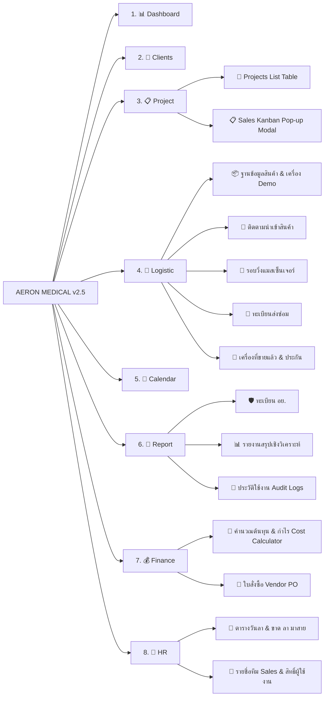
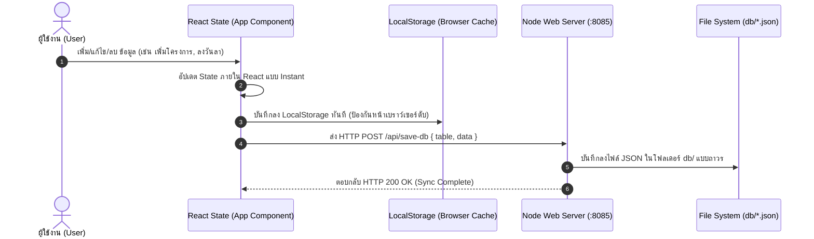
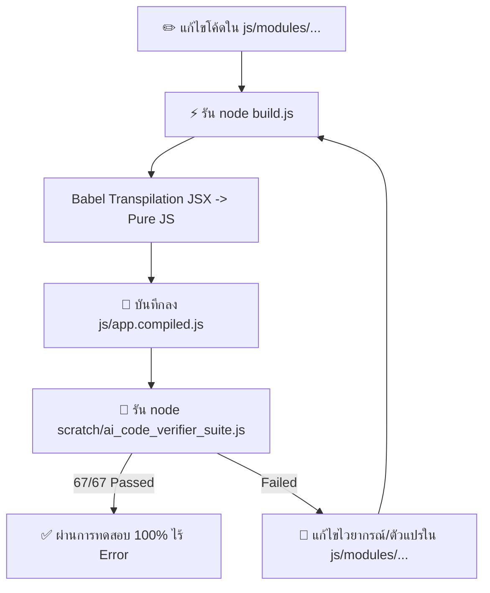

# 🏛️ พิมพ์เขียวสถาปัตยกรรม & กระบวนการทำงาน (System Architecture & Workflow Blueprint)
**บริษัท แอรอน เมดิคอล จำกัด (AERON MEDICAL Co., Ltd.) — Version 2.5**

เอกสารฉบับนี้จัดทำขึ้นเพื่อถอดสถาปัตยกรรมระบบ (Architecture) และกระบวนการทำงาน (Workflow) ทั้งหมดของระบบ **AERON MEDICAL Project Tracker & Financial Calculator** ออกมาเป็นมาตรฐานสากล อ่านเข้าใจง่ายสำหรับมนุษย์ (Human-readable) และสมบูรณ์พร้อมสำหรับให้ **AI Coding Assistant** นำไปพัฒนาต่อยอดได้ทันทีโดยไม่เกิดข้อผิดพลาด

---

## 📑 สารบัญ (Table of Contents)

1. [🏛️ ภาพรวมสถาปัตยกรรมระบบ (High-Level Architecture)](#1-ภาพรวมสถาปัตยกรรมระบบ-high-level-architecture)
2. [🗺️ ผังโครงสร้างแอปพลิเคชัน 8 แท็บหลัก (Application Sitemap & 8 Primary Tabs)](#2-ผังโครงสร้างแอปพลิเคชัน-8-แท็บหลัก-application-sitemap--8-primary-tabs)
3. [🔄 กระบวนการไหลของข้อมูล (Data Lifecycle & Persistence Workflow)](#3-กระบวนการไหลของข้อมูล-data-lifecycle--persistence-workflow)
4. [🛠️ สถาปัตยกรรมซอฟต์แวร์และการคอมไพล์ (Babel Build & Verification Workflow)](#4-สถาปัตยกรรมซอฟต์แวร์และการคอมไพล์-babel-build--verification-workflow)
5. [📦 ระบบสำรองข้อมูลและการย้อนกลับ (Backup & Revert System)](#5-ระบบสำรองข้อมูลและการย้อนกลับ-backup--revert-system)
6. [🧱 บัญชีรายชื่อคอมโพเนนต์ทั้ง 39 รายการ (39 Components Reference)](#6-บัญชีรายชื่อคอมโพเนนต์ทั้ง-39-รายการ-39-components-reference)
7. [📜 กฎเหล็กของโปรเจกต์ (Mandatory Project Rules)](#7-กฎเหล็กของโปรเจกต์-mandatory-project-rules)

---

## 1. 🏛️ ภาพรวมสถาปัตยกรรมระบบ (High-Level Architecture)

ระบบถูกออกแบบในรูปแบบ **Single Page Application (SPA)** ที่มีความเร็วสูง ไม่ต้องโหลดหน้าใหม่ (Zero Page Reload) โดยใช้เทคโนโลยีที่ไม่พึ่งพาคอมไพเลอร์ฝั่งเซิร์ฟเวอร์ที่ซับซ้อน แต่ใช้การพรีคอมไพล์ JSX ล่วงหน้าเพื่อประสิทธิภาพสูงสุด:

```mermaid
graph TD
    Client[🖥️ Web Browser / Chrome DevTools] -->|HTTP GET /| WebServer[🚀 Node.js Web Server :8085]
    Client -->|Loads Script| InitData[📄 js/initialData.js - Static Mock & Constants]
    Client -->|Loads Pre-compiled Bundle| AppCompiled[⚡ js/app.compiled.js - Compiled Pure JS]
    
    subgraph Frontend Runtime (React UMD)
        AppCompiled --> AppRoot[App Component Root State]
        AppRoot --> HeaderNav[Header & Sidebar Rail/Drawer Navigation]
        AppRoot --> MainRouter[Main Body Tab View Router]
        MainRouter --> View1[📊 Dashboard View]
        MainRouter --> View2[🏥 Clients Directory View]
        MainRouter --> View3[📋 Projects & List Table View]
        MainRouter --> View4[🚚 Logistic & Assets View]
        MainRouter --> View5[📅 Demo Calendar View]
        MainRouter --> View6[📑 FDA & Analytical Reports View]
        MainRouter --> View7[💰 Finance & Cost Calculator View]
        MainRouter --> View8[👥 HR & Leave Schedule View]
        AppRoot --> Popups[🚀 Modals & Pop-up System - Kanban Pop-up, Cost Sheet, etc.]
    end

    subgraph Data Persistence Layer
        AppRoot -->|Auto Sync| LocalStorage[(💾 Browser LocalStorage)]
        AppRoot -->|POST /api/save-db| WebServer
        WebServer -->|Write File| JSONDB[(📁 db/*.json Database Files)]
    end
```

### 🛠️ Technology Stack

* **Frontend Engine:** React 18 (UMD Build) + ReactDOM
* **UI & Styling:** Custom Glassmorphic Dark Design System + Tailwind CSS + Vanilla CSS Tokens
* **Chart & Visualization:** Chart.js 4.x
* **Build System:** Babel 8.0 Pre-compilation Runner (`build.js`)
* **Backend Web Server:** Node.js HTTP Server (`server.js` Running on Port 8085)
* **Storage Layer:** Dual Persistence (LocalStorage Cache + Server JSON Files in `db/`)

---

## 2. 🗺️ ผังโครงสร้างแอปพลิเคชัน 8 แท็บหลัก (Application Sitemap & 8 Primary Tabs)

การเข้าถึงฟีเจอร์แบ่งออกเป็น 8 หมวดหมู่หลัก (Primary Navigation Tabs) ที่สามารถสลับผ่านแถบไอคอนฝั่งซ้าย (`SidebarIconRail`) หรือเมนูป๊อปอัป (`SidebarNavDrawer`):



---

## 3. 🔄 กระบวนการไหลของข้อมูล (Data Lifecycle & Persistence Workflow)

ข้อมูลในระบบถูกจัดการผ่านวงจรความปลอดภัย 3 ระดับ (Triple-layer Protection):



---

## 4. 🛠️ สถาปัตยกรรมซอฟต์แวร์และการคอมไพล์ (Babel Build & Verification Workflow)

เพื่อความเสถียร ซอร์สโค้ดหลักจะถูกเขียนแยกเป็น 39 โมดูลใน `js/modules/` แล้วพรีคอมไพล์ไปยัง `js/app.compiled.js` ซึ่งเบราว์เซอร์จะโหลดไปทำงานได้ทันทีโดยไม่ต้องพึ่งพาทรานสไพเลอร์ runtime:



---

## 5. 📦 ระบบสำรองข้อมูลและการย้อนกลับ (Backup & Revert System)

ระบบมีกลไกสร้าง Checkpoint อัตโนมัติ ป้องกันข้อมูลหรือโค้ดสูญหายเมื่อมีการสั่งงานใหม่:

1. **การสร้าง Backup Checkpoint (`backup.js` / `Create_Backup.bat`):**
   - สำรองไฟล์โครงการทั้งหมดลงในโฟลเดอร์ `backups/checkpoint_YYYYMMDD_HHMMSS/`
   - อัปเดตพอยเตอร์มาที่ `backups/checkpoint_latest/`
2. **การ Revert ย้อนกลับ 1-Click (`revert.js` / `Revert_To_Last_Checkpoint.bat`):**
   - เมื่อต้องการย้อนกลับโค้ดและฐานข้อมูลไปยังจุดล่าสุดที่สมบูรณ์ สามารถดับเบิ้ลคลิกไฟล์ `Revert_To_Last_Checkpoint.bat` ระบบจะกู้คืนไฟล์ทั้งหมดทันที

---

## 6. 🧱 บัญชีรายชื่อคอมโพเนนต์ทั้ง 39 รายการ (39 Components Reference)

| # | ชื่อคอมโพเนนต์ (Component Name) | ประเภท (Type) | หน้าที่และการทำงาน (Description & Responsibility) |
|---|---|---|---|
| 1 | `SidebarIconRail` | Navigation Rail | แถบไอคอนทางลัดฝั่งซ้ายสุด แสดงสถานะการ์ดแจ้งเตือน (Badges) |
| 2 | `SidebarNavDrawer` | Pop-up Drawer | เมนูป๊อปอัปสไลด์จากซ้าย เลือกสลับหน้าหลักทั้ง 8 แท็บ |
| 3 | `Header` | Top Header | แถบส่วนหัว แสดงโลโก้ AERON MEDICAL, ปุ่ม Kanban Pop-up, Dropdown เลือกหัวข้อย่อย |
| 4 | `LoginModal` | Modal | หน้าต่างลงชื่อเข้าใช้ และปุ่มสลับบทบาท 6 Roles |
| 5 | `ManagerDashboard` | Main View | หน้าภาพรวมผลงาน Executive Overview, กราฟสรุปยอดขาย และ KPI |
| 6 | `ClientsDirectoryView` | Main View | ฐานข้อมูลโรงพยาบาลพันธมิตร, รายชื่อแพทย์ผู้สั่งซื้อ และจัดอันดับสถาบัน |
| 7 | `HospitalDetailModal` | Modal | หน้าต่าง Pop-up แสดงรายละเอียดโรงพยาบาล โครงการ คิว Demo |
| 8 | `ProductCatalogView` | Main View | คลังสินค้าทางการแพทย์, รายการเครื่อง Demo และประวัติการจอง |
| 9 | `ShipmentTrackingView` | Main View | ตารางติดตามชิปปิ้งนำเข้าจากต่างประเทศ, AWB, ปริมาตร CBM และภาษี อย. |
| 10 | `RepairServiceView` | Main View | ศูนย์ซ่อม & เคลมสินค้า ทั้งเครื่อง Demo, เครื่อง รพ. ในประกันและนอกประกัน |
| 11 | `SoldProductsView` | Main View | ทะเบียนเครื่องที่ขายแล้ว, วันหมดอายุประกัน และประวัติการบำรุงรักษา |
| 12 | `MessengerDispatchView` | Main View | หน้าระบบจัดส่งพัสดุและเอกสารสัญญาราชการสำหรับบทบาท Messenger |
| 13 | `DemoCalendarView` | Main View | หน้าปฏิทินจองคิวเครื่อง Demo และตารางจองงานสาธิต |
| 14 | `MonthCalendarGrid` | Sub Component | กริตปฏิทินรายเดือนคำนวณวันและแสดง Event การจองเครื่อง Demo |
| 15 | `FDARegistrationView` | Main View | ทะเบียน อย., คลาสเครื่องมือแพทย์ และสถานะการยื่นขอใบอนุญาต |
| 16 | `AnalyticalReportsView` | Main View | ศูนย์สรุปรายงานเชิงวิเคราะห์ 8 หมวดหมู่ พร้อมตัวกรอง Multi-Filter & Export CSV |
| 17 | `CostCalculationView` | Main View | ตารางคำนวณต้นทุน/กำไร (Cost Calculator) สเปรดชีตต้นทุน CIF & % Margin |
| 18 | `PurchaseOrderView` | Main View | ทะเบียนใบสั่งซื้อ Vendor PO และติดตามสถานะการจ่ายเงิน/ออกของ |
| 19 | `LeaveAttendanceView` | Main View | ตารางวันลา ขาด ลา มาสาย สรุปยอดหักเงินเดือนประจำเดือน |
| 20 | `LeaveModal` | Modal | โมดอลยื่นใบลาป่วย/ลากิจ/ลาพักร้อน |
| 21 | `AttendanceModal` | Modal | โมดอลบันทึกการลงเวลา ขาดงาน หรือมาสาย |
| 22 | `ProjectCard` | Sub Component | การ์ดแสดงรายละเอียดโครงการขายใน Kanban Board |
| 23 | `MemberKanban` | Sub Component | คอลัมน์ Kanban แบ่งตามขั้นตอนงานขาย (Sales Stages) |
| 24 | `ProjectModal` | Modal | โมดอลสร้าง/แก้ไขรายละเอียดโครงการขาย |
| 25 | `WeeklyLogModal` | Modal | โมดอลบันทึกความคืบหน้ารายสัปดาห์ พร้อมระบบอัดเสียง & AI สรุปงาน |
| 26 | `MemberManagementModal` | Modal | โมดอลจัดการรายชื่อเซลล์และระดับสิทธิ์ผู้ใช้ |
| 27 | `DemoBookingModal` | Modal | โมดอลลงทะเบียนจองคิวเครื่อง Demo |
| 28 | `ProductModal` | Modal | โมดอลเพิ่ม/แก้ไขข้อมูลสินค้าในคลัง |
| 29 | `PurchaseOrderModal` | Modal | โมดอลออกใบสั่งซื้อ Vendor PO |
| 30 | `RepairTicketModal` | Modal | โมดอลเปิดใบส่งซ่อมเครื่องมือแพทย์ |
| 31 | `SoldProductModal` | Modal | โมดอลบันทึกขายเครื่องให้ รพ. และตั้งค่าประกัน |
| 32 | `ShipmentModal` | Modal | โมดอลบันทึกรายการนำเข้าสินค้าและค่าขนส่ง |
| 33 | `FDAModal` | Modal | โมดอลบันทึกการจดทะเบียน อย. |
| 34 | `ProjectHistoryModal` | Modal | โมดอลแสดงประวัติบันทึกย้อนหลังของโครงการ |
| 35 | `CostSheetModal` | Modal | โมดอลคำนวณสเปรดชีตต้นทุน CIF และพิมพ์เอกสาร |
| 36 | `ReportPreviewModal` | Modal | โมดอลพรีวิวตัวอย่างรายงานเอกสารสรุป |
| 37 | `App` | Root Container | ศูนย์กลางจัดการ Global State, Routing, และ Data Persistence ทั้งหมด |

---

## 7. 📜 กฎเหล็กของโปรเจกต์ (Mandatory Project Rules)

> [!IMPORTANT]
> **กฎเหล็กการทำงานและพัฒนาโปรเจกต์ AERON MEDICAL System v2.5:**
> 
> 1. 🚨 **กฎการทดสอบเสถียรภาพก่อนส่งงาน (Mandatory Test Run Verification)**:
>    - **ทุกครั้งที่มีการแก้ไขโค้ด**: จะต้องทำการสั่งรันคอมไพล์ (`build.js`) และรันสคริปต์ทดสอบเสถียรภาพ (`scratch/ai_code_verifier_suite.js` / `scratch/deep_test_every_single_tab.js`) เพื่อยืนยันว่าระบบทำงานได้สมบูรณ์ 100% ไร้ข้อผิดพลาด **ก่อนเรียกผู้ใช้งานมาดูหรือส่งมอบงานเสมอ**
> 
> 2. 📦 **กฎการสำรองข้อมูลและรองรับการ Revert 100% (Backup & Revert Guarantee)**:
>    - **ต้องสร้าง Backup Checkpoint ทุกครั้ง**: เมื่อมีการแก้ไขฟีเจอร์หรือโครงสร้างระบบ ให้สั่งรัน `node backup.js` เพื่อสร้างจุดย้อนกลับ (`backups/checkpoint_YYYYMMDD_HHMMSS/`) เสมอ
>    - **รองรับการ Revert ย้อนกลับได้ทุกเมื่อ**: สามารถใช้ `Revert_To_Last_Checkpoint.bat` หรือ `node revert.js` กู้คืนโค้ดและข้อมูลกลับไปยังจุดที่เสถียรล่าสุดได้ทันที
> 
> 3. 🛡️ **กฎการแก้ไขแบบไร้ผลกระทบข้างเคียง (Zero Side-Effects & Ask Before Breaking)**:
>    - **ห้ามกระทบฟังก์ชันหรือหน้าตาเดิม**: การปรับปรุงหรือแก้ไขฟังก์ชันใดๆ ต้องกระทำโดย **ไม่กระทบหรือทำให้ส่วนอื่นๆ เสียหาย** (Zero Unintended Side-Effects)
>    - **หาวิธีการใหม่จนกว่าจะไม่กระทบ**: หากเกิดผลกระทบต่อหน้าตา (UI Layout) หรือฟังก์ชันอื่นๆ ขึ้น ให้ AI หาวิธีการออกแบบโครงสร้างใหม่ (Alternative Approach) จนกว่าจะแก้ไขได้โดยไม่กระทบส่วนใด
>    - **หากจำเป็นต้องกระทบจริงๆ ให้ถามก่อน**: ในกรณีที่การแก้ไขมีความจำเป็นต้องส่งผลกระทบต่อโครงสร้างเดิมอย่างหลีกเลี่ยงไม่ได้ **ให้หยุดและถามความยินยอมจากผู้ใช้งานก่อนทำการแก้ไขเสมอ**

---

*เอกสารฉบับนี้เป็นลิขสิทธิ์ของ บริษัท แอรอน เมดิคอล จำกัด (AERON MEDICAL Co., Ltd.) — ปรับปรุงล่าสุดวันที่ 1 สิงหาคม 2569*
